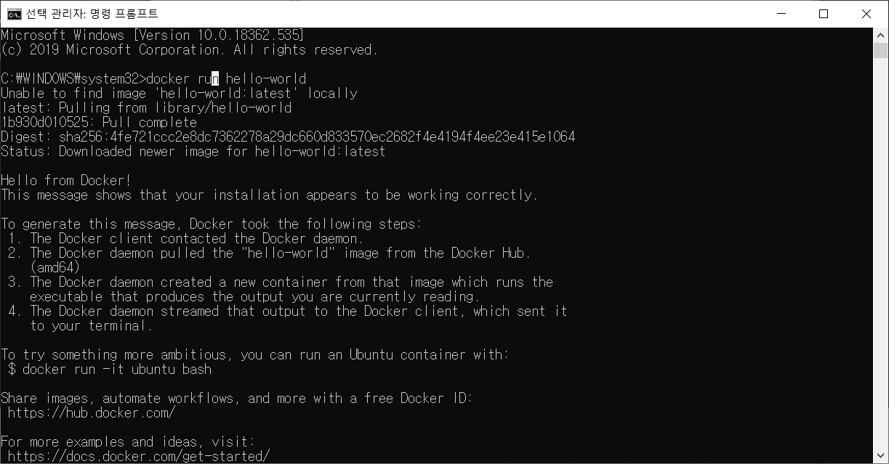

# Tensorflow TIL

Machine Learning Lecture: [모두를 위한 딥러닝 시즌 2 on Youtube](https://www.youtube.com/playlist?list=PLQ28Nx3M4Jrguyuwg4xe9d9t2XE639e5C)

### Requirements

- [Docker for Window 10 or upper (64-bit)](https://hub.docker.com/?overlay=onboarding)
  - [Hyper-v 설정](https://docs.microsoft.com/ko-kr/virtualization/hyper-v-on-windows/quick-start/enable-hyper-v)
    - 관리자 권한으로 cmd 실행
    - `DISM /Online /Enable-Feature /All /FeatureName:Microsoft-Hyper-V`
    - Window >> 앱 및 기능 >> 프로그램 및 기능 >> Windows 기능 켜기/끄기 >> Hyper-v 체크

- Test Hello world
  - `$ docker run hello-world`
  - 

## 1. Machine Learning Basic 

- What is ML?

  - Why we use? Limitations of explicit programming
  - Arthur Samuel(1959) : Field of study that gives computers the ability to learn without being explicitly programmed

- What is learning?

  1. Supervised learning: learning with labeled examples (= training set)
     - Most commom problem: Image labeling, Email spam filter, Predicting exam score
     - Training data set?
       - y: data의 label
       - x: data의 feature
       - Training data set을 통해 model을 만들게 되고, test input을 넣어 예상값을 얻는다.
     - Type of supervised learning
       - Regression : 범위 안의 값으로 예측
         - ex) Predicting final exam score(0~100) based on time spent
       - Binary classification
         - ex) Pass/non-pass
       - multi-label classification
         - ex) Grade(A, B, C, D, F)

  2. Unsupervised learning: un-labeled data (데이터를 보고 스스로 학습)

## 2. Linear Regression

선형적인 예상이 주변에 많이 있다. 예를들면, 집의 크기에 따른 부의 정도, 시간투자에 따른 시험 결과

- Hypothesis: H(x) = Wx + b
  - Which hypothesis is better?
    - 실제 데이터와 가설간의 거리가 가까울 수록 좋다.

- Cost(Loss) function: (H(x) - y)^2

  - 차이가 음수일 수도 있기 때문에 제곱하여 계산한다.
    $$
    cost = \frac{1}{m} \sum_{i=1}^m (H(x_i)-y_i)^2
    $$

- cost를 가장 작게하는 W & b를 구하는 것

- [Simple Liner Regression LAB](https://www.youtube.com/watch?v=TvNd1vNEARw&list=PLQ28Nx3M4Jrguyuwg4xe9d9t2XE639e5C&index=4)

## 3. How to minimize cost

$$
cost(W) = \frac{1}{m} \sum_{i=1}^m (H(x_i)-y_i)^2
$$

- Hypothesis 를 간략화하여 H(x) = Wx 라 하고 cost(W)를 구해본다.
  - W=1, cost(W) = 0
  - W=0, cost(W) = 4.67
  - W=2, cost(W) = 4.67
  - ...

- Gradient descent algorithm: 경사를 따라 내려가는 알고리즘(?)

  - W, b 뿐만 아니라 더 많은 인자를 갖고 있는 경우에도 쓰일 수 있다.

  - 어떤 지점에서 시작해도 상관 없다!

  - W를 바꾸면서 경사도를 구하기를 반복한다.

  - Cost(W)를 미분할 경우
    $$
    cost(W) = \frac{1}{2m} \sum_{i=1}^m (Hx_i-y_i)^2
    $$

- 

$$
W := W - \alpha \frac{\delta}{\delta W}cost(W)
$$

​		- alpha: Learning rate

- Gradient descent algorithm - cost가 최소가 되는 W값을 찾아준다. 
  $$
  W := W - \alpha \frac{1}{m}\sum_{i=1}^m (Wx_i-y_i)x_i
  $$

- **Linear Regression의 경우, Convex function인 경우에만 Gradient descent algorithm을 사용**
  
  - Convex function(볼록 함수)

- [Liner Regression and How to minimize cost LAB](https://www.youtube.com/watch?v=dtLaojGples&list=PLQ28Nx3M4Jrguyuwg4xe9d9t2XE639e5C&index=6)

## 4. Multi-variable linear regression(다변수 선형 회귀)

- Matrix multiplication
  - Hypothesis using matrix
    - matrix 장점: Data의 수와 상관없이 동일한 식으로 표현 할 수 있다. 

$$
w_1x_1 + w_2x_2 + w_3x_3 + ... + w_nx_n
$$

$$
(x_1 \ x_2 \  x_3) * {w_1 \\w_2 \choose w_3 } = (x_1w_1 + x_2w_2 + x_3w_3)
$$

$$
H(X) = XW
$$

- WX vs XW
  - 이론적인 설명: H(x) = Wx + b
  - Implementation(TensorFlow): H(X) = XW 

- [Multi-variable linear regression LAB](https://www.youtube.com/watch?v=tmfo04t664Q&list=PLQ28Nx3M4Jrguyuwg4xe9d9t2XE639e5C&index=8)

